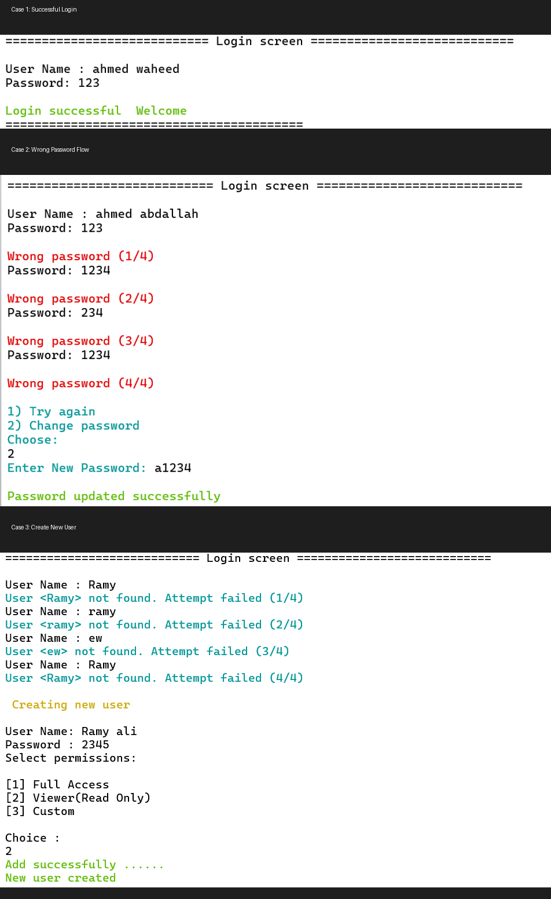
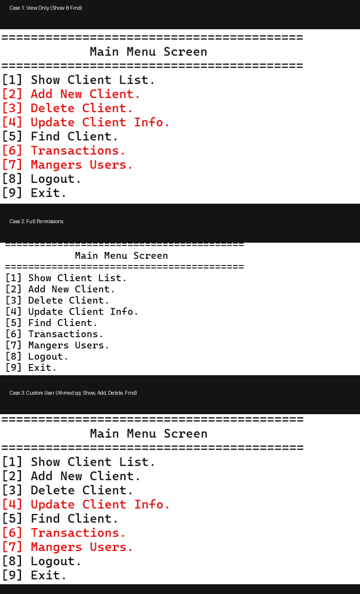
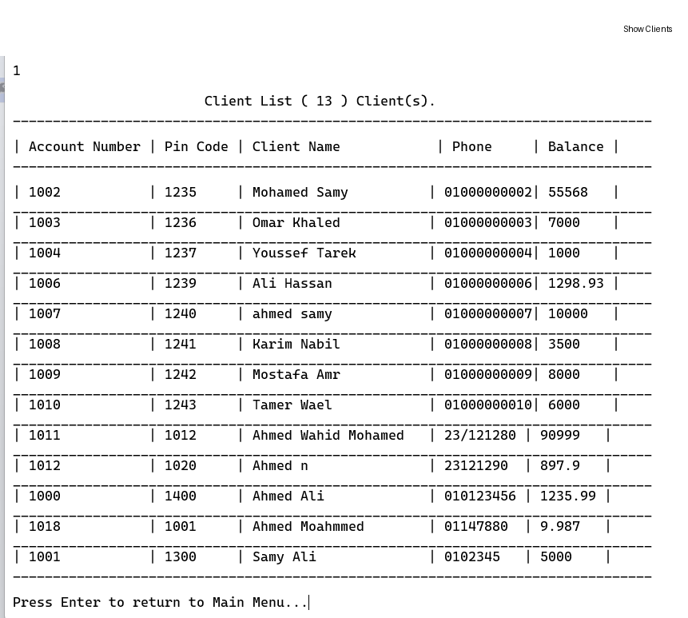
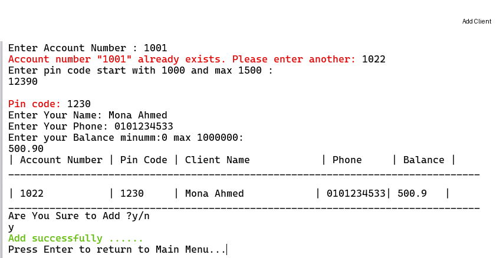
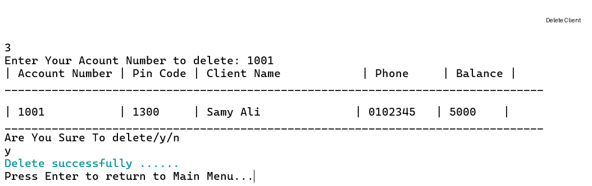
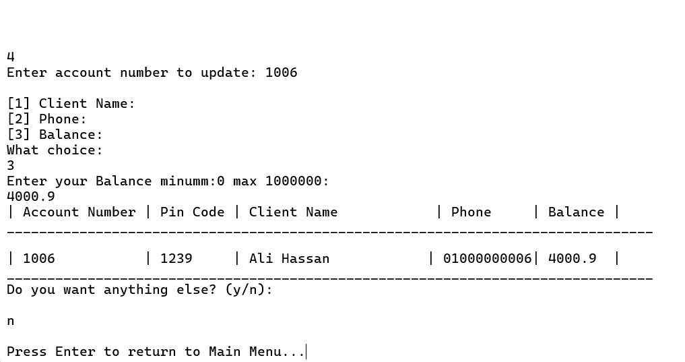
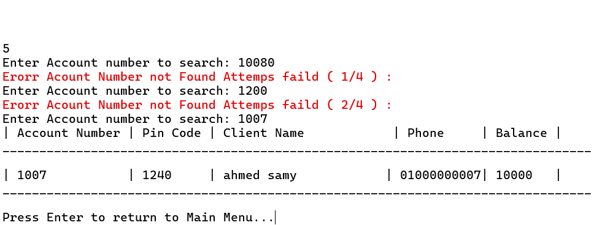
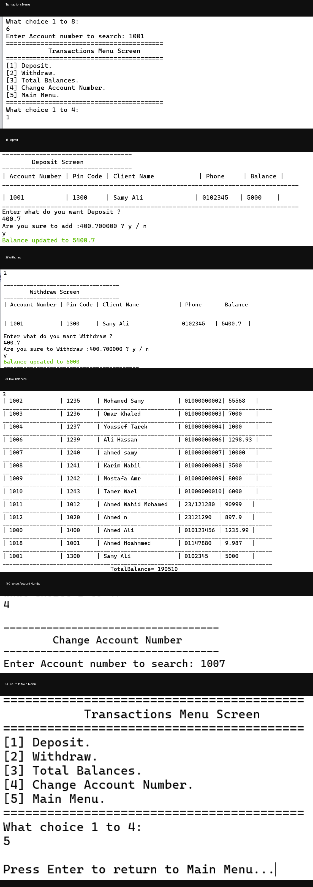
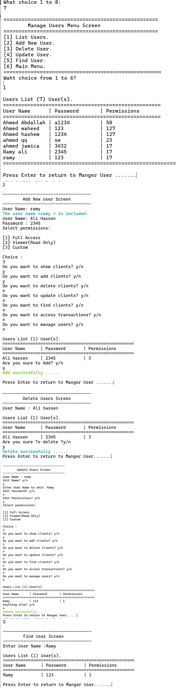

# BankSystem

Developed by Ahmed Waheed  
C++ Developer | Problem Solver
A console-based banking management system built in C++, designed with clean module separation, 
file-based persistence, and a permission-driven access model.

> Built for learning and practice, with a focus on readable and maintainable code.

---

## Features

| Module              | Operations                                                      |
|---------------------|-----------------------------------------------------------------|
| Authentication      | Login, limited attempts, password change, new user creation     |
| Client Management   | Add, delete, update, search, show all clients                   |
| Transaction System  | Deposit, withdraw, view total balances, change account number   |
| User Management     | Add, delete, update, find users                                 |
| Permission System   | Full access / Viewer / Custom permission levels                 |

---

## Project Structure
```bash
BankSystem/
├── src/
│   ├── Main.cpp
│   ├── BankSystem.cpp
│   ├── ClientManager.cpp
│   ├── UserManager.cpp
│   ├── User.cpp
│   ├── Client.cpp
│   ├── FileManager.cpp
│   ├── UI.cpp
│   └── Utils.cpp
├── include/
│   ├── BankSystem.h
│   ├── ClientManager.h
│   ├── UserManager.h
│   ├── User.h
│   ├── Client.h
│   ├── FileManager.h
│   ├── UI.h
│   ├── Utils.h
│   └── States.h
├── data/
│   ├── BankSystem.txt
│   └── User.txt
├── images/
└── README.md
```

---

## Getting Started

### Requirements
- C++17 or later
- g++ / clang++ / MSVC

### Build & Run
```bash
# Compile
g++ -std=c++17 src/*.cpp -I include -o BankSystem

# Run
./BankSystem
```

---

## Screenshots

### Login
<p align="center">
  <a href="images/Login.png">
    
  </a>
</p>

---

### Main Menu
<p align="center">
  <a href="images/menu_cases.png">
    
  </a>
</p>

---

### Client Management
#### Show Clients
<p align="center">
  <a href="images/ShowClients.png">
    
  </a>
</p>


#### Add Client
<p align="center">
  <a href="images/AddClients.png">
    
  </a>
</p>

#### Delete Client
<p align="center">
  <a href="images/DeleteClients.png">
    
  </a>
</p>


#### Update Client
<p align="center">
  <a href="images/Update.png">
    
  </a>
</p>

#### Find Client
<p align="center">
  <a href="images/FindClient.png">
    
  </a>
</p>


---

### Transactions
<p align="center">
  <a href="images/final_transactions_cases.png">
    
  </a>
</p>

---

### User Management
<p align="center">
  <a href="images/manage_users.png">
    
  </a>
</p>
---
## How It Works

The system follows a simple flow:

1. User logs into the system
2. Based on permissions, a menu is displayed
3. User selects an operation (clients, transactions, users)
4. The system processes input and updates data files
---

## Data Storage

The system uses text files for persistence:

- `data/users.txt` → stores user credentials and permissions  
- `data/clients.txt` → stores client data  

This approach keeps the system lightweight and easy to test.

---
## Future Improvements

- Add password encryption
- Replace text files with a database
- Improve UI design
- Add transaction history
- Build a graphical interface


## License

This project is licensed under the [MIT License](LICENSE).
